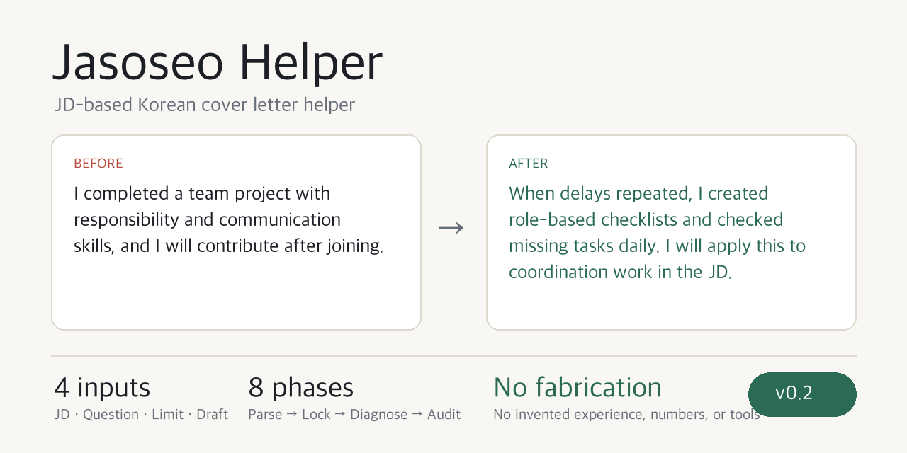

<p align="center">
  
</p>

<p align="center">
  <a href="README.md">한국어</a> |
  <a href="README.en.md">English</a>
</p>

# Jasoseo Helper - ja-so-seo-do-u-mi v0.2

In Korean hiring, **jasoseo** is short for _jagi-sogaeseo_, a self-introduction essay submitted with a job application. It overlaps with a cover letter, but it is usually written as answers to company-provided questions and often has strict Korean character limits.

Jasoseo Helper is a Codex skill that rewrites Korean job application self-introduction essays into submission-ready drafts while **preserving the applicant's intended selling points**. Paste a job posting or JD, an essay question, a length limit, and a rough draft.

This is not a general-purpose sentence polisher. The skill reads the question's intent, the JD's responsibilities and qualifications, the real experience in the draft, and the length limit together, then reshapes the essay so it **answers the question directly**. It also reduces common self-introduction essay problems: formulaic wording, obvious cliches, unsupported competency claims, company-praise templates, and exaggerated statements that would be hard to defend in an interview.

It also avoids forcing JD keywords into the essay. The skill is designed for all job seekers, not only developers. Instead of relying on field-specific jargon, it makes role-fit concrete through **the target, the problem, what the applicant did, the output, the judgment criteria, and the result**.

Since v0.2, the default behavior is **preservation-first editing**. When the user asks "polish the sentences," "revise this," or "make it sound natural," the skill first locks the core experience and appeal points in the draft, then improves the wording and structure without changing their meaning. It only restructures more aggressively when the user explicitly asks for a full rewrite, a new structure, or a submission-ready rewrite.

## Why this is specialized for jasoseo

General writing tools can make sentences smoother, but they are weak at the questions that matter in Korean self-introduction essays.

- Did the answer identify whether the question asks for motivation, job competency, collaboration, or something else?
- Does the draft connect the applicant's experience to the JD's main responsibilities?
- Are abstract claims such as "communication skills" proven through actual behavior?
- Does the essay avoid presenting team outcomes as individual achievements?
- Does it satisfy submission rules such as 700 characters, including or excluding spaces?

Jasoseo Helper handles these issues through a step-by-step workflow. It parses the input, locks the appeal points the user wants to preserve, interprets the JD and question, diagnoses weak points in the draft, rewrites it for submission, and finally verifies length, factual preservation, and intent preservation.

## Before / After

```text
Before
I successfully completed a team project based on responsibility and communication skills.
Through this, I developed problem-solving ability, and after joining the company I will quickly adapt and contribute.

After
When schedule delays kept recurring in a team project, I created role-based checklists and checked missing tasks every day.
As a result, we submitted the deliverable before the deadline, and I learned that clearly separating responsibilities improves collaboration speed.
After joining, I will apply this experience to the coordination and progress management required in the JD.
```

The point is not flashy wording. The point is **real action, results, and job relevance**.

## 8 Core Principles

1. **Preserve facts** - Do not invent experience, numbers, technologies, outcomes, or company information that were not in the original draft.
2. **Preserve intent** - Do not remove the applicant's intended strengths, experiences, or values without permission.
3. **Preservation-first default** - Unless the user explicitly asks for a full rewrite, keep the draft's central experience and message.
4. **Question first** - Build a structure that answers the question before making the sentences look polished.
5. **JD-based** - Prioritize main responsibilities and qualifications. Use preferred qualifications and company values only as supporting context.
6. **Evidence over labels** - Replace abstract labels such as responsibility, communication, and problem-solving with actions and results.
7. **Avoid JD overfitting** - Do not list JD terms. Keep only the language that connects to real experience in the draft.
8. **Submission safety** - Check character count, company name, role name, blind hiring risks, and interview defensibility.

## Architecture

```text
Job posting/JD + question + length limit + draft
    ↓
[intake-parser]
    Split the pasted input into JD, question, length limit, and draft
    ↓
[appeal-lock]
    Lock the applicant's core claims, experience, strengths, and values
    ↓
[jd-parser]
    Extract company name, role name, main responsibilities, qualifications, preferred qualifications, and tech stack
    ↓
[question-classifier]
    Identify the question type, such as motivation, job competency, collaboration, failure, or future goals
    ↓
[draft-diagnoser]
    Detect missing answers, weak JD connection, abstract language, cliches, and exaggeration risk
    ↓
[rewrite-planner]
    Plan which experience to preserve, which background to reduce, and how to strengthen action/result/JD connection
    ↓
[application-rewriter]
    Rewrite the draft into a submission-ready self-introduction essay
    ↓
[application-naturalness-pass]
    Remove formulaic jasoseo wording and unnatural expressions
    ↓
[submission-auditor]
    Verify factual preservation, intent preservation, length, question coverage, and JD fit
    ↓
Final submission draft + revision summary
```

## 8 Internal Modules

| Module                         | Role                                                                                                     |
| ------------------------------ | -------------------------------------------------------------------------------------------------------- |
| `intake-parser`                | Automatically separates pasted text into JD, question, length limit, and draft                           |
| `appeal-lock`                  | Protects the appeal points the user wants to preserve before rewriting                                   |
| `jd-parser`                    | Extracts main responsibilities, qualifications, preferred qualifications, tech stack, and talent profile |
| `question-classifier`          | Determines the question type and required answer elements                                                |
| `draft-diagnoser`              | Detects structure problems, lack of evidence, cliches, and exaggeration risks                            |
| `rewrite-planner`              | Plans which experiences to keep and which sentences to reduce                                            |
| `application-naturalness-pass` | Removes formulaic self-introduction essay wording and mechanical expressions                             |
| `submission-auditor`           | Checks length, factual/intent preservation, JD connection, and interview defensibility                   |

## Application Naturalness Categories

| ID    | Category                                     | Representative problem                                                            |
| ----- | -------------------------------------------- | --------------------------------------------------------------------------------- |
| AN-1  | Ghostwritten sentences that blur experience  | "strengthened competency," "deepened understanding," "meaningful time"            |
| AN-2  | Cliche jasoseo endings                       | "contribute to your company," "grow together," "do my best"                       |
| AN-3  | Exposed writing formulas                     | STAR/CAR labels, slogan-like subtitles, repetitive paragraph openings             |
| AN-4  | Unsupported competency labels                | Communication, responsibility, or analytical ability without action evidence      |
| AN-5  | Motivation filled with company praise        | Abstract praise that reads like rewritten company copy                            |
| AN-6  | Empty future goals                           | Long-term vision without concrete first-job actions                               |
| AN-7  | Repetitive reflection endings                | Paragraphs ending only with lessons, feelings, or thoughts without job connection |
| AN-8  | Emotion-heavy motivation                     | Strong emotion without the trigger of interest or follow-up action                |
| AN-9  | Excessive modesty or overconfidence          | Claims that are weaker or stronger than the evidence supports                     |
| AN-10 | Claims that cannot be defended in interviews | Numbers, technologies, outcomes, or vague "led" claims missing from the source    |
| AN-11 | JD keyword overfitting                       | Many job terms, but real experience and action become hidden                      |

The full rules are in [`application-naturalness-rules.md`](skills/ja-so-seo-do-u-mi/references/application-naturalness-rules.md).

## Handling by question type

| Question type          | Core handling                                                                                                    |
| ---------------------- | ---------------------------------------------------------------------------------------------------------------- |
| Motivation             | Connect role/JD interest, the applicant's experience, and contribution direction instead of praising the company |
| Job competency         | Prioritize experience, role, action, result, and JD connection over competency labels                            |
| Collaboration/conflict | Focus on coordination method, decision-making, and result rather than conflict description                       |
| Failure/overcoming     | Focus on cause analysis, improvement actions, and retry results instead of emotional narrative                   |
| Strengths/weaknesses   | Connect strengths to the role, and include improvement actions for weaknesses                                    |
| Personal growth        | Focus on events that shaped job-related competency instead of chronological life history                         |
| Future goals           | Ground the answer in first contribution actions based on the JD instead of grand vision                          |
| Free-form question     | Position around one strongest job-relevant experience                                                            |

Detailed criteria are in [`question-taxonomy.md`](skills/ja-so-seo-do-u-mi/references/question-taxonomy.md).

## Usage - takes about 3 minutes

### 0. Prerequisite

[Codex CLI](https://developers.openai.com/codex/) must be installed.

Check the installation:

```bash
codex --version
```

### 1. Clone the repository

```bash
git clone https://github.com/gwagjiug/ja-so-seo-do-u-mi.git
cd ja-so-seo-do-u-mi
```

### 2. Register it as a Codex plugin

Run this from the repository root:

```bash
codex plugin marketplace add .
```

If it is already registered, start a new Codex session so Codex reads the latest files.

### 3. Paste your jasoseo material

You do not need a complicated template. These four parts are enough.

```text
Use Jasoseo Helper to revise this for submission.

Job posting/JD:
[paste the job posting]

Essay question:
[paste the question]

Length limit:
[for example: within 700 Korean characters, including spaces]

Draft:
[paste your draft]
```

### 4. Review the result

The default output is simple.

```text
[Final submission draft]

Length: 684/700 Korean characters (standard: including spaces)

Preserved core points:
- Experience reducing schedule delays in a team project
- The applicant's action of creating role-based checklists

Revision summary:
- Classified the question as job competency and restructured around experience
- Connected the JD's schedule management/collaboration keywords to the draft experience
- Removed cliches such as "I will grow" and "I will contribute"
- Did not add numbers or outcomes that were not in the source
```

## When the input is incomplete

Jasoseo Helper does not force users into a long form. It asks a short follow-up only in cases like these:

- The user asks for a target length, but no length limit is provided
- There are multiple questions, but only one draft, so matching is unclear
- A sentence would require performance numbers or technical proficiency that are not in the draft
- Blind hiring rules appear important, but the criteria are unclear

Example:

```text
I need to confirm one thing. Is this question limited to 700 Korean characters including spaces, or excluding spaces?
```

## Trust mechanisms

This skill is not a "guaranteed acceptance" tool. Instead, it includes safeguards so the result can be trusted.

### 1. Reference-based judgment

The main skill file stays short, and detailed judgment rules are separated into reference files.

| File                                                                                                       | Role                                            |
| ---------------------------------------------------------------------------------------------------------- | ----------------------------------------------- |
| [`intake-schema.md`](skills/ja-so-seo-do-u-mi/references/intake-schema.md)                                 | Input parsing rules                             |
| [`jd-parser-rules.md`](skills/ja-so-seo-do-u-mi/references/jd-parser-rules.md)                             | JD structure extraction rules                   |
| [`question-taxonomy.md`](skills/ja-so-seo-do-u-mi/references/question-taxonomy.md)                         | Required elements by question type              |
| [`field-writing-rules.md`](skills/ja-so-seo-do-u-mi/references/field-writing-rules.md)                     | Practical jasoseo writing principles            |
| [`diagnosis-taxonomy.md`](skills/ja-so-seo-do-u-mi/references/diagnosis-taxonomy.md)                       | Weak draft diagnosis taxonomy                   |
| [`application-naturalness-rules.md`](skills/ja-so-seo-do-u-mi/references/application-naturalness-rules.md) | Rules for naturalizing formulaic jasoseo writing |
| [`rewrite-playbook.md`](skills/ja-so-seo-do-u-mi/references/rewrite-playbook.md)                           | Rewrite prescriptions                           |
| [`audit-checklist.md`](skills/ja-so-seo-do-u-mi/references/audit-checklist.md)                             | Final verification checklist                    |

### 2. No fact fabrication

These are treated as hard failures:

- Adding numbers that were not in the source
- Describing unused technologies as if the applicant is proficient with them
- Presenting team outcomes as individual outcomes
- Getting company names, role names, or project names wrong
- Avoiding the question with polished but irrelevant sentences
- Removing something the user explicitly wanted to preserve without explanation

### 3. Intent preservation

Before writing the final draft, the skill first locks what the applicant appears to emphasize in the draft.

- Experiences mentioned repeatedly
- The core claim placed near the beginning of the draft
- Content the user marked as "please keep this" or "I want to emphasize this"
- Strengths, attitudes, and values the applicant wants to show

When the skill must shorten or remove content because of length limits or submission risk, it explains the reason in `shortened/omitted parts`.

### 4. Avoiding JD overfitting

The JD is not a keyword list to paste into the essay. It is context that tells the writer what the reader is likely looking for.

- Prioritize main responsibilities and qualifications over preferred qualifications.
- Do not invent technologies, tools, or outcomes that are not in the draft.
- Reduce job terms when they hide the real experience.
- Do not stop at "I will improve." Convert it into the first action or output relevant to the role.

### 5. Length verification

Use [`count_korean_length.py`](skills/ja-so-seo-do-u-mi/scripts/count_korean_length.py) to check Korean character length including spaces, excluding spaces, UTF-8 bytes, and EUC-KR bytes.

```bash
python3 skills/ja-so-seo-do-u-mi/scripts/count_korean_length.py final.txt --json
```

### 6. Interview defensibility

Strong claims left in the final draft can invite follow-up questions in an interview. The skill avoids making unsupported sentences stronger, and leaves `needs confirmation` when needed.

```text
Needs confirmation:
- If you have a concrete number for "sales improvement," please share it. The current draft has no number, so I expressed the result qualitatively.
```

## If you do not like the result

Give another natural-language instruction.

- "Make it a little more plain-spoken."
- "Expand it closer to 700 characters."
- "Emphasize job competency more than company motivation."
- "This sentence feels exaggerated. Tone it down."
- "Also give me interview questions that may come from this essay."

## Do-NOT List

The skill does not invent or change the following on its own.

- Numbers, periods, dates, and amounts
- Company names, role names, school names, institution names, and project names
- Technologies used, certificates, awards, papers, and product names
- Direct quotations or the original essay question
- The boundary between team outcomes and individual contribution
- Personal information that may be prohibited in blind hiring

## Roadmap

| Version | Goal                                                                  |
| ------- | --------------------------------------------------------------------- |
| v0.1    | Codex skill structure and JD/question/draft-based submission revision |
| v0.2    | Preservation-first editing, Appeal Lock, and intent preservation eval |
| v0.3    | Batch mode for processing multiple questions at once                  |
| v0.4    | Expanded company-specific and role-specific evaluation references     |
| v0.5    | Web UI or desktop workflow integration                                |

## License & Ethics

This project is a tool for improving the quality of self-introduction essays. It should not be used to fabricate experience or write content that differs from the applicant's real background.

It does not guarantee hiring outcomes. Before submitting, the applicant must verify the facts and the company's submission rules.

---

Built with Codex skill/plugin structure.
