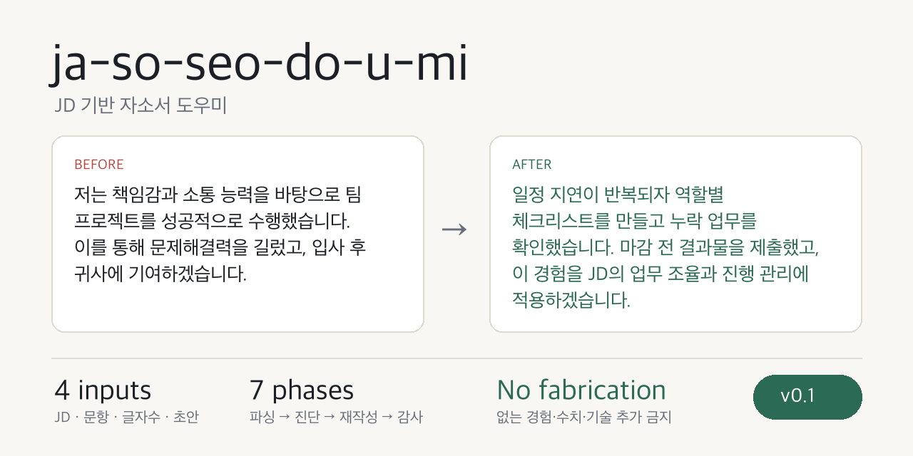

<p align="center">
  
</p>

# 자소서 도우미 - ja-so-seo-do-u-mi v0.2

채용공고/JD, 자기소개서 문항, 글자수 제한, 거친 초안만 붙여넣으면 **사용자의 어필 의도를 보존하면서 기업 제출용 자기소개서**로 다듬는 Codex 스킬입니다.

이 스킬은 문항이 묻는 의도, JD의 주요업무와 자격요건, 초안 속 실제 경험, 글자수 제한을 함께 읽고 **문항에 답하는 구조**로 다듬습니다. 동시에 자소서 특유의 공식 문체, 뻔한 클리셰, 근거 없는 역량 주장, 회사 칭찬 템플릿, 면접에서 방어하기 어려운 과장 표현을 줄입니다.

JD 키워드를 억지로 끼워 넣는 방식도 피합니다. 개발자뿐 아니라 모든 취준생이 쓸 수 있도록, 직무에 맞는 구체성은 특정 분야의 언어가 아니라 **대상, 문제, 내가 한 행동, 산출물, 판단 기준, 결과**로 잡습니다.

v0.2부터 기본 동작은 **보존형 첨삭**입니다. 사용자가 "문장만 다듬어줘", "수정해줘", "자연스럽게 해줘"라고 하면 초안의 핵심 경험과 어필 포인트를 먼저 잠그고, 그 의미를 유지한 채 문장과 구조를 개선합니다. "아예 새로 써줘", "구조를 갈아엎어줘", "제출본으로 재작성해줘"처럼 명시한 경우에만 더 적극적으로 재구성합니다.

## 왜 자소서 특화인가

일반 글쓰기 교정기는 문장을 매끄럽게 만들 수는 있지만, 자소서에서 중요한 질문에는 약합니다.

- 이 문항이 지원동기를 묻는지, 직무역량을 묻는지 구분했는가
- JD의 주요업무와 초안의 경험이 연결되는가
- "소통 능력" 같은 추상어가 실제 행동으로 증명되는가
- 팀 성과를 개인 성과처럼 과장하지 않았는가
- 700자 이내, 공백 포함/제외 같은 제출 조건을 지켰는가

자소서 도우미는 이런 문제를 단계별 워크플로우로 나눠 처리합니다. 먼저 입력을 파싱하고, 초안에서 사용자가 살리고 싶은 어필 포인트를 잠근 뒤, JD와 문항을 해석하고, 초안의 약점을 진단하고, 제출용 문장으로 다듬고, 마지막에 글자수와 사실/의도 보존을 검증합니다.

## Before / After

```text
Before
저는 책임감과 소통 능력을 바탕으로 팀 프로젝트를 성공적으로 수행했습니다.
이를 통해 문제해결력을 기를 수 있었고, 입사 후 빠르게 적응해 귀사에 기여하겠습니다.

After
팀 프로젝트에서 일정 지연이 반복되자 역할별 체크리스트를 만들고 누락 업무를 매일 확인했습니다.
그 결과 마감 전 결과물을 제출했고, 담당 범위를 명확히 나누는 방식이 협업의 속도를 높인다는 점을 배웠습니다.
입사 후에도 JD에서 요구하는 업무 조율과 진행 관리에 이 경험을 적용하겠습니다.
```

핵심은 표현의 화려함이 아니라 **실제 행동, 결과, 직무 연결**입니다.

## 8대 철칙

1. **사실 보존** - 원문에 없는 경험, 수치, 기술, 성과, 회사 정보를 만들지 않습니다.
2. **의도 보존** - 사용자가 어필하려는 강점, 경험, 가치관은 허락 없이 날리지 않습니다.
3. **보존형 기본값** - 명시적 재작성 요청이 없으면 초안의 중심 경험과 메시지를 유지합니다.
4. **문항 우선** - 멋진 문장보다 문항에 정확히 답하는 구조를 먼저 만듭니다.
5. **JD 기반** - 주요업무와 자격요건을 우선 반영하고, 우대사항과 인재상은 보조로만 씁니다.
6. **근거 중심** - 책임감, 소통능력, 문제해결력 같은 추상어를 행동과 결과로 바꿉니다.
7. **JD 과적합 방지** - JD 용어를 나열하지 않고, 초안 속 실제 경험과 연결되는 말만 남깁니다.
8. **제출 안전성** - 글자수, 회사명, 직무명, 블라인드 위반 가능성, 면접 방어 가능성을 점검합니다.

## 아키텍처

```text
채용공고/JD + 문항 + 글자수 + 초안
    ↓
[intake-parser]
    입력을 JD, 문항, 글자수, 초안으로 분리
    ↓
[appeal-lock]
    사용자가 어필하려는 핵심 주장, 경험, 강점, 가치관을 잠금
    ↓
[jd-parser]
    회사명, 직무명, 주요업무, 자격요건, 우대사항, 기술스택 추출
    ↓
[question-classifier]
    지원동기, 직무역량, 협업, 실패, 포부 등 문항 유형 판정
    ↓
[draft-diagnoser]
    문항 미응답, JD 연결 부족, 추상어, 클리셰, 과장 리스크 탐지
    ↓
[rewrite-planner]
    살릴 경험, 줄일 배경, 강화할 행동/결과/JD 연결 설계
    ↓
[application-rewriter]
    기업 제출용 자기소개서로 재작성
    ↓
[application-naturalness-pass]
    자소서 특화 공식 문체와 부자연스러운 표현 제거
    ↓
[submission-auditor]
    사실 보존, 의도 보존, 글자수, 문항 응답, JD 적합성 검증
    ↓
최종 제출본 + 수정 요약
```

## 8개 내부 모듈

| 모듈                           | 역할                                                   |
| ------------------------------ | ------------------------------------------------------ |
| `intake-parser`                | 붙여넣은 텍스트에서 JD, 문항, 글자수, 초안을 자동 분리 |
| `appeal-lock`                  | 초안에서 사용자가 살리고 싶은 어필 포인트를 먼저 보호  |
| `jd-parser`                    | 주요업무, 자격요건, 우대사항, 기술스택, 인재상 추출    |
| `question-classifier`          | 문항 유형과 필수 답변 요소 판정                        |
| `draft-diagnoser`              | 초안의 구조 문제, 근거 부족, 클리셰, 과장 리스크 탐지  |
| `rewrite-planner`              | 어떤 경험을 살리고 어떤 문장을 줄일지 설계             |
| `application-naturalness-pass` | 자소서 전용 공식 문체와 기계적 표현 제거               |
| `submission-auditor`           | 글자수, 사실/의도 보존, JD 연결, 면접 방어 가능성 검증 |

## 자소서 자연화 분류

| ID    | 대분류                       | 대표 문제                                             |
| ----- | ---------------------------- | ----------------------------------------------------- |
| AN-1  | 경험을 흐리는 대리 작성 문장 | "역량을 강화", "이해도를 높임", "의미 있는 시간"    |
| AN-2  | 자소서 클리셰 결말           | "귀사에 기여", "함께 성장", "최선을 다함"           |
| AN-3  | 노출된 작성 공식             | STAR/CAR 라벨, 구호형 소제목, 같은 방식의 문단 시작  |
| AN-4  | 근거 없는 역량명             | 소통능력, 책임감, 분석력만 있고 행동 증거가 없음     |
| AN-5  | 회사 칭찬으로 채운 지원동기  | 회사 소개 문구를 바꿔 쓴 듯한 추상적 칭찬            |
| AN-6  | 공허한 입사 후 포부          | 장기 비전만 있고 첫 업무 행동이 없음                 |
| AN-7  | 반복되는 회고 종결           | 배움, 느낌, 생각으로만 문단을 닫고 직무 연결이 없음  |
| AN-8  | 감정 과잉 지원동기           | 감정은 큰데 관심이 생긴 계기와 이후 행동이 없음      |
| AN-9  | 과잉 겸손 또는 과잉 확신     | 근거보다 낮추거나 세게 말하는 표현                   |
| AN-10 | 면접 방어 불가 주장          | 원문에 없는 수치, 기술, 성과, 모호한 "주도"          |
| AN-11 | JD 키워드 과적합             | 직무 용어는 많은데 실제 경험과 행동이 묻히는 문장    |
| AN-12 | 방어적 대조 패턴             | "단순히 X가 아닌", "그저 X를 넘어", 부정 먼저 강조   |

전체 규칙은 [`application-naturalness-rules.md`](skills/ja-so-seo-do-u-mi/references/application-naturalness-rules.md)에 정리되어 있습니다.

## 문항 유형별 처리

| 문항         | 핵심 처리                                            |
| ------------ | ---------------------------------------------------- |
| 지원동기     | 회사 칭찬보다 JD/직무 관심, 내 경험, 기여 방향 연결  |
| 직무역량     | 역량명보다 경험, 역할, 행동, 결과, JD 연결 우선      |
| 협업/갈등    | 갈등 설명보다 조율 방식, 의사결정, 결과 중심         |
| 실패/극복    | 감정 서사보다 원인 분석, 개선 행동, 재시도 결과 중심 |
| 성격 장단점  | 장점은 직무와 연결, 단점은 개선 행동 포함            |
| 성장과정     | 연대기 나열보다 직무 역량 형성에 영향을 준 사건 중심 |
| 입사 후 포부 | 거창한 비전보다 JD 기반 첫 기여 행동 중심            |
| 자유문항     | 가장 강한 직무 관련 경험 하나를 중심으로 포지셔닝    |

상세 기준은 [`question-taxonomy.md`](skills/ja-so-seo-do-u-mi/references/question-taxonomy.md)에 있습니다.

## 사용법 - 3분이면 됩니다

### 0. 전제

[Codex CLI](https://developers.openai.com/codex/)가 설치되어 있어야 합니다.

설치 확인:

```bash
codex --version
```

### 1. 리포 받기

```bash
git clone https://github.com/gwagjiug/ja-so-seo-do-u-mi.git
cd ja-so-seo-do-u-mi
```

### 2. Codex 플러그인으로 등록

리포 루트에서 실행합니다.

```bash
codex plugin marketplace add .
```

이미 등록되어 있다면 최신 파일 기준으로 다시 읽기 위해 Codex 세션을 새로 여는 것을 권장합니다.

### 3. 자소서 붙여넣기

복잡한 템플릿은 필요 없습니다. 아래 네 가지만 있으면 됩니다.

```text
자소서 도우미로 제출용으로 수정해줘.

채용공고/JD:
[채용공고 복붙]

자소서 문항:
[문항 복붙]

글자수:
[예: 700자 이내, 공백 포함]

초안:
[내 초안]
```

### 4. 결과 확인

기본 출력은 간단합니다.

```text
[최종 제출본]

글자수: 684/700자 (기준: 공백 포함)

살린 핵심:
- 팀 프로젝트에서 일정 지연을 줄인 경험
- 역할별 체크리스트를 만든 본인의 행동

수정 요약:
- 문항을 직무역량형으로 판단해 경험 중심으로 재구성
- JD의 일정 관리/협업 키워드를 초안 경험과 연결
- "성장하겠습니다", "기여하겠습니다" 같은 클리셰 제거
- 원문에 없는 수치나 성과는 추가하지 않음
```

## 입력이 부족할 때

자소서 도우미는 사용자를 긴 양식으로 몰아넣지 않습니다. 다만 아래 경우에는 짧게 되묻습니다.

- 글자수 제한이 없는데 글자수를 맞춰달라고 한 경우
- 문항이 여러 개인데 초안이 하나라 매칭이 불분명한 경우
- 초안에 없는 성과 수치나 기술 숙련도를 넣어야만 문장이 성립하는 경우
- 블라인드 채용 여부가 중요해 보이는데 기준이 불명확한 경우

예:

```text
확인할 점이 하나 있습니다. 이 문항은 공백 포함 700자 기준인가요, 공백 제외 700자 기준인가요?
```

## 신뢰 장치

이 스킬은 "합격 보장" 도구가 아닙니다. 대신 결과를 신뢰할 수 있도록 다음 장치를 둡니다.

### 1. Reference 기반 판단

스킬 본문은 짧게 유지하고, 세부 판단은 reference 파일로 분리했습니다.

| 파일                                                                                                       | 역할                        |
| ---------------------------------------------------------------------------------------------------------- | --------------------------- |
| [`intake-schema.md`](skills/ja-so-seo-do-u-mi/references/intake-schema.md)                                 | 입력 파싱 기준              |
| [`jd-parser-rules.md`](skills/ja-so-seo-do-u-mi/references/jd-parser-rules.md)                             | JD 구조 추출 기준           |
| [`question-taxonomy.md`](skills/ja-so-seo-do-u-mi/references/question-taxonomy.md)                         | 문항 유형별 필수 요소       |
| [`field-writing-rules.md`](skills/ja-so-seo-do-u-mi/references/field-writing-rules.md)                     | 실전 자소서 작성 원칙       |
| [`diagnosis-taxonomy.md`](skills/ja-so-seo-do-u-mi/references/diagnosis-taxonomy.md)                       | 구린 초안 진단 체계         |
| [`application-naturalness-rules.md`](skills/ja-so-seo-do-u-mi/references/application-naturalness-rules.md) | 자소서 공식 문체 자연화 규칙 |
| [`rewrite-playbook.md`](skills/ja-so-seo-do-u-mi/references/rewrite-playbook.md)                           | 재작성 처방                 |
| [`audit-checklist.md`](skills/ja-so-seo-do-u-mi/references/audit-checklist.md)                             | 최종 검증 체크리스트        |

### 2. 사실 조작 방지

다음은 하드 실패로 봅니다.

- 원문에 없는 수치 추가
- 사용해보지 않은 기술을 숙련된 것처럼 표현
- 팀 성과를 개인 성과처럼 표현
- 회사명, 직무명, 프로젝트명 오류
- 문항이 묻지 않은 멋진 문장으로 답변을 회피
- 사용자가 꼭 살리고 싶다고 한 내용을 설명 없이 삭제

### 3. 의도 보존

최종본을 쓰기 전에 초안에서 사용자가 강조하려는 내용을 먼저 잠급니다.

- 반복해서 말한 경험
- 초안 앞부분에 배치한 핵심 주장
- "꼭 살려줘", "강조하고 싶어"라고 한 내용
- 사용자가 보여주고 싶은 강점, 태도, 가치관

글자수나 제출 리스크 때문에 줄이거나 빼야 할 때는 `축약/생략한 부분`에 이유를 남깁니다.

### 4. JD 과적합 방지

JD는 자소서에 붙여 넣을 키워드 목록이 아니라, 읽는 사람이 무엇을 보고 싶어 하는지 알려주는 맥락으로 사용합니다.

- 우대사항보다 주요업무와 자격요건을 우선합니다.
- 초안에 없는 기술, 도구, 성과를 새로 만들지 않습니다.
- 직무 용어가 실제 경험을 가리면 과감히 줄입니다.
- "개선하겠습니다"에서 멈추지 않고, 직무에 맞는 첫 행동이나 산출물로 바꿉니다.

### 5. 글자수 검증

[`count_korean_length.py`](skills/ja-so-seo-do-u-mi/scripts/count_korean_length.py)로 공백 포함, 공백 제외, UTF-8 byte, EUC-KR byte 기준을 확인할 수 있습니다.

```bash
python3 skills/ja-so-seo-do-u-mi/scripts/count_korean_length.py final.txt --json
```

### 6. 면접 방어 가능성

최종본에 남는 강한 주장은 면접에서 꼬리질문을 받을 수 있습니다. 그래서 근거가 없는 문장은 더 세게 쓰지 않고, 필요하면 `확인 필요`로 남깁니다.

```text
확인 필요:
- "매출 개선"의 구체 수치가 있다면 알려주세요. 현재 초안에는 수치가 없어 정성 결과로만 표현했습니다.
```

## 결과가 마음에 안 들면

자연어로 다시 지시하면 됩니다.

- "조금 더 담백하게"
- "700자에 더 가깝게 늘려줘"
- "회사 지원동기보다 직무역량을 더 강조해줘"
- "이 문장은 너무 과장된 것 같아 낮춰줘"
- "면접에서 물어볼 만한 질문도 뽑아줘"

## Do-NOT List

이 스킬은 아래 내용을 임의로 만들거나 바꾸지 않습니다.

- 수치, 기간, 날짜, 금액
- 회사명, 직무명, 학교명, 기관명, 프로젝트명
- 사용 기술, 자격증, 수상, 논문, 제품명
- 직접 인용 또는 제출 문항 원문
- 팀 성과와 개인 기여의 경계
- 블라인드 채용에서 금지될 수 있는 개인정보

## 로드맵

| 버전 | 목표                                           |
| ---- | ---------------------------------------------- |
| v0.1 | Codex 스킬 구조, JD/문항/초안 기반 제출본 수정 |
| v0.2 | 보존형 첨삭, Appeal Lock, 의도 보존 eval 추가  |
| v0.3 | 문항 여러 개를 한 번에 처리하는 batch 모드     |
| v0.4 | 회사별/직무별 평가 포인트 reference 확장       |
| v0.5 | 웹 UI 또는 데스크톱 워크플로우 연동            |

## 라이선스 & 윤리

이 프로젝트는 자기소개서 품질 개선을 돕기 위한 도구입니다. 없는 경험을 만들거나, 지원자의 실제 이력과 다른 내용을 작성하는 용도로 쓰지 않습니다.

채용 결과를 보장하지 않으며, 최종 제출 전에는 반드시 본인이 사실 여부와 회사 제출 기준을 확인해야 합니다.

---

Built with Codex skill/plugin structure.
